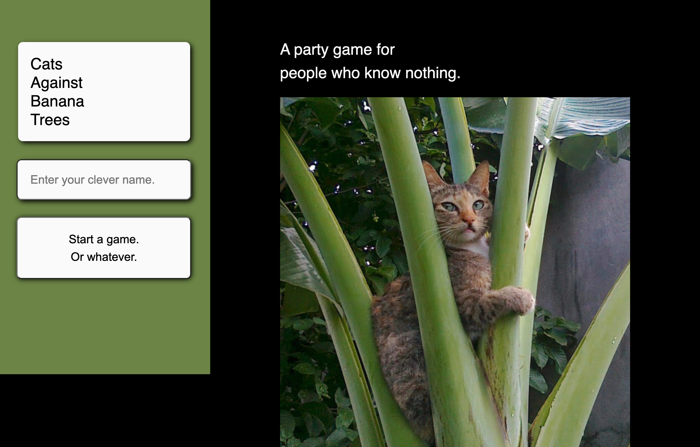
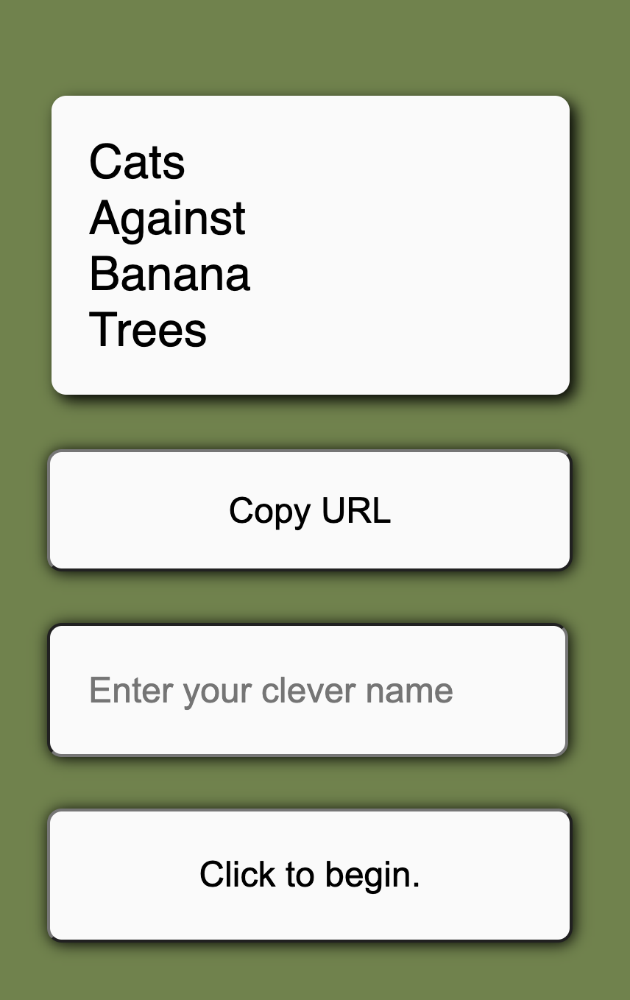

# Cats Against Banana Trees

IN A WORLD where you can't get together with your friends to enjoy drinks, trash talk, and inappropriate card based humor, Cats Against Banana Trees sets a new paradigm. Using a combination of chat features and an interactive UI/UX, you can once again play all your favorite combinations that would make your parents blush.

---

## Description

Satisfy the itch to make your friends and family uncomfortable, all from the safety of your couch or toilet. Create your own clever username and join your game-mates in furious banter while selecting the best(?) answer for each round.

Cats Against Banana Trees (CABT) uses socket.io, sequelize, and express-handlebars to deliver a multiplayer online Cards Against Humanity&copy; style experience. Players are able to create their own unique username and then enter a game. During gameplay, socket.io enables both live chat and an interactive and real-time player ui.

---

## Table of Contents

[Installation](#installation)  
 [Usage](#usage)  
 [License](#MIT_license)  
 [Contributing](#contributing)  
 [Contact](#contact)

---

## Installation

For local installation:

[Fork the repo from github](https://github.com/mjmoon15/cats-against-bananahammocks). Install npm dependencies. Update the db password in the config.json file. Run node server.js for localhost access.

---

## Usage

[Access the deployed app on heroku here](https://catsagainstbananatrees.herokuapp.com/)

Enter a username and click Start a game. Or Whatever.

Host welcome page 

After signing in, the user can copy the URL and send it to a friend. If they have any.

The second user is directed to this page, which functions as a waiting room.

---

## MIT_License

    Copyright (c) [2020] [Scott Griffin, Mark Mooney, Elizabeth Regas]

    Permission is hereby granted, free of charge, to any person obtaining a copy
    of this software and associated documentation files (the "Software"), to deal
    in the Software without restriction, including without limitation the rights
    to use, copy, modify, merge, publish, distribute, sublicense, and/or sell
    copies of the Software, and to permit persons to whom the Software is
    furnished to do so, subject to the following conditions:

    The above copyright notice and this permission notice shall be included in all
    copies or substantial portions of the Software.

    THE SOFTWARE IS PROVIDED "AS IS", WITHOUT WARRANTY OF ANY KIND, EXPRESS OR
    IMPLIED, INCLUDING BUT NOT LIMITED TO THE WARRANTIES OF MERCHANTABILITY,
    FITNESS FOR A PARTICULAR PURPOSE AND NONINFRINGEMENT. IN NO EVENT SHALL THE
    AUTHORS OR COPYRIGHT HOLDERS BE LIABLE FOR ANY CLAIM, DAMAGES OR OTHER
    LIABILITY, WHETHER IN AN ACTION OF CONTRACT, TORT OR OTHERWISE, ARISING FROM,
    OUT OF OR IN CONNECTION WITH THE SOFTWARE OR THE USE OR OTHER DEALINGS IN THE
    SOFTWARE.

---

## Contributing

Fork the repo and suggest changes via github.

---

## Contact

[For Scott Griffin's github porfolio, click here.](https://github.com/scott-gr)

[To contact Scott, please email him at mscottgriffin@gmail.com.](mailto:mscottgriffin@gmail.com)

---

[For Mark Mooney's github porfolio, click here.](https://github.com/mjmoon15)

[To contact Mark, please email him at mjmoon15@gmail.com.](mailto:mjmoon15@gmail.com)

---

[For Elizabeth Regas' github porfolio, click here.](https://github.com/ElizaRegas)
  
 [To contact Elizabeth, please email her at elizaregas@gmail.com.](mailto:elizaregas@gmail.com)

---

© 2019 Trilogy Education Services, a 2U, Inc. brand. All Rights Reserved.
